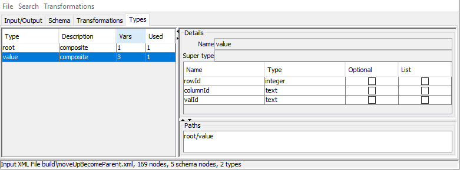

# TreeOps (Tree Operations) 

[](https://travis-ci.org/treeops/treeops)

TreeOps is a visual tool for reading, transforming and comparing tree data in different formats. The following formats are supported:
* XML
* JSON 
* CSV

TreeOps defines set of data tree transformations to facilitate typical data manipulations:
* filtering and deleting irrelevant data
* renaming and moving nodes along the tree
* flattening and de-flattening to convert between tree and tabular formats
* change nodes using regular expressions under selected nodes

Transformations can be saved and re-applied again later. 

TreeOps can effortlessly generate Java classes that will read and represent transformed data as simple POJOs(plain old java objects).

User can select paths to be ignored by comparison.

The project is hosted on [github](https://github.com/treeops/treeops)


## Table of contents
1. [Example: Use Case](#usecase)
1. [Example: Transforming XML to CSV](#examplexml2csv)
1. [Example: Comparing](#comparing)
1. [Example: Filtering](#filtering)
1. [Example: Indexing and Regular expressions](#ExampleIndexing)
1. [Example: Group and append child name](#ExampleGroup)
1. [Example: Customizing generated code and inheritance](#ExampleInheritance)
1. [Structural, value-holder and value nodes](#structural)
1. [Tree schema information](#Schema)
1. [Transformations](#Transformations)
1. [Types tab](#Types)
1. [Installation](#Installation)
1. [License](#License)
1. [Related links](#RelatedLinks)


## Use case <a name="usecase"></a>

Third-party data processing is a common requirement in modern software development. Data can be presented as a single file or a collection of files and might come without a detailed description (e.g. XML schema/DTD/JSON schema).
Even when the description is provided in some cases the relevant data subset for your project is much more simple than the unfiltered data.

Initial data analysis can be done in TreeOps visual tool based on the samples provided by third-party:

* read file(collection) into a tool 
* see the unique paths within input tree and node multiplicity
* get rid of irrelevant data
* move data nodes around to match your requirements
* replace text in some nodes using regular expressions
* flatten/export data to tabular format for further processing, e.g. using statistical methods(R)
* save transformations so they can be applied again

Then you can easily re-apply transformations to the new data received using the generated code or visual tool.

This tasks can be achieved using custom code or XSLT transformations.


## Example: Transforming XML to CSV <a name="examplexml2csv"></a>

Suppose we want to convert following XML to CSV:

```xml
<root>
    <row rowId="1">
        <column columnId="row1col1">
            <value valId="row1col1val1"/>
            <value valId="row1col1val2"/>
        </column>
        <column columnId="row1col2">
            <value valId="row1col2val1"/>
            <value valId="row1col2val2"/>
        </column>
    </row>
    <row rowId="2">
        <column columnId="row2col1">
            <value valId="row2col1val1"/>
            <value valId="row2col1val2"/>
        </column>
        <column columnId="row2col2">
            <value valId="row2col2val1"/>
            <value valId="row2col2val2"/>
        </column>
    </row>
</root>
```

We can load XML into the tool using menu File/Load Xml or by using tab Input/Output to type text directly. 
Please note, that when the folder is selected, all files with relevant extension will be imported recursively.

Enter text into the Text Input textfield and press "Load as XML text" button:


"Table" tab now displays two rows, as the root node have two children. 
We would like to flatten the tree to display 8 rows in the table.
* Click on "Schema" tab, which displays all unique paths in the input tree
* Right click on row "root/row/column/value" and select "Transformations/Move Up As parent" menu item.
* Right click on row "root/row/value" and select "Transformations/Move Up As parent" menu item.


* Now we can switch to "Input/Output" tab and select "Table" tab in the output panel to observe the output. 


* We can improve table by removing "Column" and "Row" columns and reordering nodes. Go to "Schema" tab, 
* Right click on "root/value/column/columnId" and select "Transformations/Move Up" menu item.
* Right click on "root/value/row/rowId" and select "Transformations/Move Up" menu.
* Right click on "root/value/row" and select "Transformations/Delete" menu. Repeat for "root/value/column"
* Right click on "root/value/rowId" and select "Transformations/Reorder Up" menu. Do it twice to move rowId to be before "valId"
* Right click on "root/value/columnId" and select "Transformations/Reorder Up" menu.


* You can export export the flattened data to file using File/Export CSV menu
* Transformations can be viewed and deleted by using "Transformations" tab 


## Example: Comparing <a name="comparing"></a>

Lets compare two XML trees: 

```xml
<?xml version="1.0" encoding="UTF-8" standalone="no"?>
<order>
    <customer name="John"/>
    <item productId="soap" quantity="100"/>
    <item productId="bread" quantity="20"/>
</order>
```

and 

```xml
<?xml version="1.0" encoding="UTF-8" standalone="no"?>
<order>
    <customer/>
    <item productId="soap" quantity="30"/>
</order>

```

* Switch to the "Input/Output" tab
* Type first XML text into the input text area and press "Load as XML text" button
* Save the second XML file into some file, say "c:\somefile.xml"
* Switch to "Compare" tab, press "Compare with XML ..." button. Now open file "c:\somefile.xml":


* Now lets ignore the difference in customer - right click on the "order/customer/name" and select "Ignore" menu:


The result:


## Example: Filtering <a name="filtering"></a>

Filtering transformation removes root's children that do not have given node. 
Load the following XML:

```xml
<?xml version="1.0" encoding="UTF-8" standalone="no"?>
<friends>
    <friend age="8" name="Emma" sport="tennis">
        <pet>
            <dog collarType="leather" name="Bear"/>
        </pet>
    </friend>
    <friend age="9" name="Bob" sport="football">
        <pet>
            <dog collarType="chain" name="Bella"/>
        </pet>
    </friend>
    <friend age="10" name="Nick" sport="badminton">
        <pet>
            <cat favouriteCatFood="fish" name="Fluffy"/>
        </pet>
    </friend>
</friends>
```


We would like to filter out all friends that do not have a dog. 
* Switch to the "Schema" tab
* Right click on "friends/friend/pet/dog" and select "Transformations/Filter" menu. 


* you can see result in JSON format in "Input/Output" tab:

```json
[
    {
        "name": "Emma",
        "sport": "tennis",
        "age": "8",
        "pet": {
            "dog": {
                "collarType": "leather",
                "name": "Bear"
            }
        }
    },
    {
        "name": "Bob",
        "sport": "football",
        "age": "9",
        "pet": {
            "dog": {
                "collarType": "chain",
                "name": "Bella"
            }
        }
    }
]
```

## Example: Indexing and Regular expressions<a name="ExampleIndexing"></a>

Indexing transformation adds index within parent as suffix.

```xml
<?xml version="1.0" encoding="UTF-8" standalone="no"?>
<root>
    <element>
        <name>first</name>
    </element>
    <element>
        <name>second</name>
    </element>
</root>
```

* Load XML using Input/Output tab
* Switch to "Schema" tab
* Right-click on "root/element" and select "Transformations/Indexing"


* Indexes have been added:


We can use other regular expression transformations to revert Indexing:

* Switch to "Schema" tab
* Right-click on "root" and select "Transformations/Insert child for all nodes matching Reg exp"


* Enter "element[0-9]" as the regular expression and "elementId" as the new node name. Press "OK" button:


Two new nodes have been added 


Now lets get rid of index suffix:
* Right-click on "root" and select "Transformations/Regular expression"
* Enter  "element[0-9]" as the regular expression and "element" as the replacement. Press "OK" button:


* Now we will delete the "elementId" node.  Right-click on the "root" and select "Transformations/Delete"


Now we have our original tree back after applying number of transformations:


## Example: Group and append child name<a name="ExampleGroup"></a>

Suppose we want to group rows in the following XML by the color:

```xml
<root>
    <row color="green" id="1"/>
    <row color="green" id="2"/>
    <row color="blue" id="3"/>
</root>
```

Let's load this file into the tool using Input panel:


* Switch to the "Schema" tab
* Right-click on "root/row" and select "Transformations/Group"


* select "color" in the dropdown list and press "OK" button:


Rows have been grouped by color:


Let's append color to the Group node name. 
* Right-click on "root/Group" and select "Transformations/Append child Name"


* Select "row/color" in the dropdown list and press "OK" button:


Now color have been appended to the Group:


## Example: Customizing generated code and inheritance <a name="ExampleInheritance"></a>

Suppose we want to read following file into the object model:

```xml
<friends>
    <friend age="8" name="Emma" sport="tennis">
        <pet>
            <dog collarType="leather" name="Bear"/>
        </pet>
    </friend>
    <friend age="9" name="Bob" sport="football">
        <pet>
            <dog collarType="chain" name="Bella"/>
        </pet>
    </friend>
    <friend age="10" name="Nick" sport="badminton">
        <pet>
            <cat favouriteCatFood="fish" name="Fluffy"/>
        </pet>
    </friend>
</friends>
```

Let's load this file into the tool using Input panel:


We would like to generate Java classes to read this file into the friendly object model. 
* Navigate to "Schema" tab
* We would like to use enumeration for Sports, so right click on "friends/friend/sport" and select "Types/Make Enum"


* Type "Sport" as enum name and press "OK". 
* Right-click on "friends/friend/sport" and select "Types/Show type". 
"Types" tab will be displayed with "friend" type selected. 
Now you can see the type changed from "text" to "Sports" and new Sports type had been added.


Double click on path "friends/friend" in the bottom right corner to show "Schema" tab again.
Now we would like to introduce Animal type for "cat" and "dog" to inherit from. 
* Right-click on "friends/friend/pet/dog" and select "Types/Change Super Type". Type "Animal" and press "OK". 
* Right-click on "friends/friend/pet/cat" and select "Types/Change Super Type". Type "Animal" and press "OK". 
* Right-click on "friends/friend/pet/dog/name" and select "Types/Move to Super Type". 
* Right-click on "friends/friend/pet/cat/name" and select "Types/Move to Super Type". 
* Right-click on "friends/friend/pet" and select "Types/Join mutually exclusive". Type pet as name and check both "cat" and "dog":


* Right-click on "friends/friend/pet" and select "Types/Show type" to observe new type Animal 
	and note that both "cat" and "dog" now extend from "Animal"


* Go to menu File/Generate Java. 
* Type desired package name and press "OK"
* Select output folder and press "OK"
* The following classes will be generated :

```java

public class Friends {
	private List<Friend> friend = new ArrayList<>();
}

public class Friend {
	private String name;
	private Sport sport;
	private Integer age;
	private Pet pet;
}

public class Pet {
	private Animal animal;
}

public class Animal {
	private String name;
}	

public class Cat extends Animal {
	private String favouriteCatFood;
}

public class Dog extends Animal {
	private String collarType;
}	

public enum Sport {
	BADMINTON("badminton"), FOOTBALL("football"), TENNIS("tennis");
}

public class Reader {
	public static void main(String[] args) throws Exception {
		Friends res = readFriends(readXml(new File(args[0])));
	}
	public static DataNode readJson(File file) throws Exception {
		return Transformation.runAll(readTransformations(), JsonReader.read(file));
	}
	public static DataNode readXml(File file) throws Exception {
		return Transformation.runAll(readTransformations(), XmlReader.read(file));
	}
	public static DataNode readCsv(File file) throws Exception {
		return Transformation.runAll(readTransformations(), CsvReader.read(file));
	}
	public static Friends readFriends(DataNode n) {
		Friends o = new Friends();
		for (DataNode c : DataNode.children(n)) {
			if ("friend".equals(c.getName())) {
				o.getFriend().add(readFriend(c));
			}
		}
		return o;
	}
	
```


## Structural, value-holder and value nodes <a name="structural"></a>
Nodes in the input tree are divided into value-holder nodes, value nodes and structural nodes. 
Value-holder nodes can have up to one leaf child which holds its value.  
Value nodes don't have children.
For example in the tree below:
* Structural nodes:  "bookstore", "bookstore/book", "bookstore/book/title"
* Value nodes: "bookstore/book/category", "bookstore/book/title/language", "bookstore/book/title/_text_"


## Tree schema information <a name="Schema"></a>

The tool displays following schema information for each unique path (excluding value nodes) in the input tree:  
* Name
* Optional - whether the node is always present if parent node is present
* Whether it is a value holder node or structural
* Max mumber of occurrences within parent
* Total number of nodes with this path
* leaf node flag
* list of distinct values(up to 30) for value nodes

## Transformations <a name="Transformations"></a>

All transformations take at least one parameter - selected node.
* Delete   -  Deletes node and its children
* Filter  - Removes root's children that do not have given node
* Rename -  Rename node to a given name
* RegExp  - Rename all nodes under the node using regular expression. Takes two parameters - regular expression and replacement expression.
* Indexing  - adds index within parent as suffix
* Append child name - Append name of the child as suffix  
* Move Up - node becomes sibling of parent. If the current node has multiple occurrences this can lead to data loss, addressed by Move Up as Parent transformation.
* Move Up as Parent - node becomes the only child of parent's parent and parent's siblings become be children of the current node
* Move Siblings Down - siblings become children
* Move To Sibling - node become child of a sibling
* Insert parent - adds an intermediate parent node
* Insert child - adds a child
* Insert child for all nodes matching Regex - adds child node for all nodes matching regular expression 
* Group - add parent "group" node for each distinct value of the choosen node   
* Remove Duplicates -  Remove duplicated nodes with given path (under the same parent)  
* Reorder  - Reorder(moves up or down) nodes with given path within the parent
* To Value/To Structural - change node type to be value node or structural

## Types tab <a name="Types"></a>
"Types" tab displays all types found in a tree. Nodes with the same name are considered to be of the same type. 
When type is selected, type's variables and paths are displayed. You can navigate to the relevant schema node by double-clicking on the path.



## Installation <a name="Installation"></a>

TreeOps is built in Java Swing. In order to start visual tool, type:

```
gradlew run
```

or build the project and use java -jar option:

```
gradlew build
java -jar TreeOps.jar
```


## License <a name="License"></a>


Copyright (c) 2006-2017 TreeOps.org 

Licensed under the [Apache Licence v2](https://www.apache.org/licenses/LICENSE-2.0.txt)


## Related <a name="RelatedLinks"></a>
* [XML Transformations](https://en.wikipedia.org/wiki/XSLT)
* [XML Schema](https://en.wikipedia.org/wiki/XML_Schema_(W3C))
* [JSON Schema](https://en.wikipedia.org/wiki/JSON#JSON_Schema)
* [JSON to JSON transform https://github.com/bazaarvoice/jolt](https://github.com/bazaarvoice/jolt)
* [Stackoverflow discussion https://stackoverflow.com/questions/1618038/xslt-equivalent-for-json](https://stackoverflow.com/questions/1618038/xslt-equivalent-for-json)


